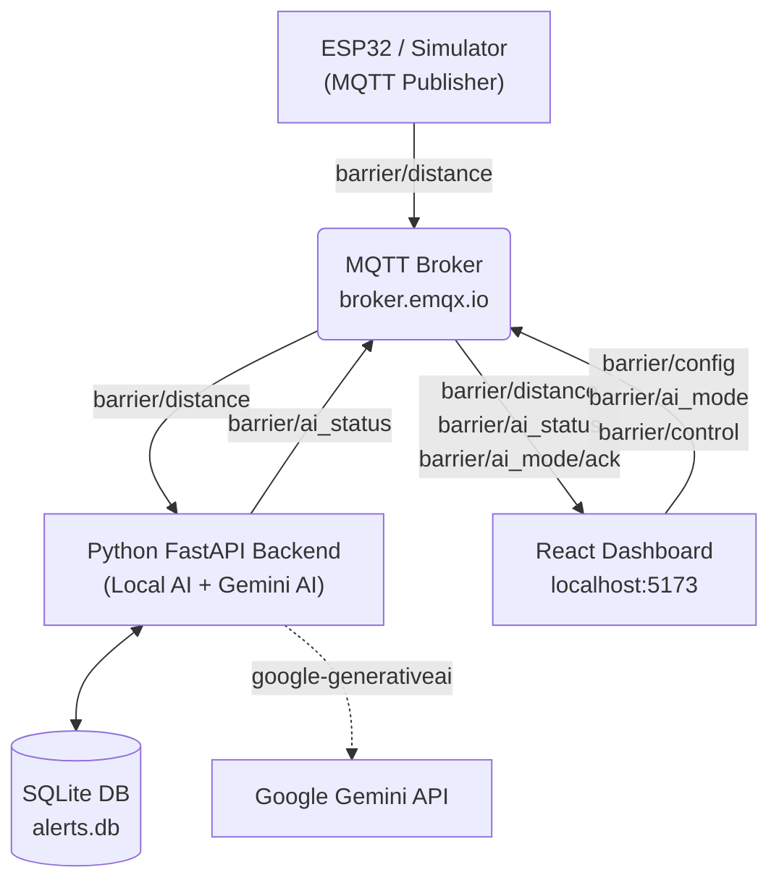

# Smart Proximity-Based Automatic Barrier System

An end-to-end IoT system that monitors and controls an automatic barrier using real-time ultrasonic distance data. It features an MQTT-based ESP32 simulator, a Python/FastAPI backend with **dual AI engines** (Local rule-based + Google Gemini), and a modern React dashboard for live visualization, manual override, and configuration.

---

## Project Structure

```
smart_barrier/
├── backend/
│   ├── main.py           # FastAPI server + AI analysis (Local & Gemini) + MQTT
│   ├── simulator.py      # ESP32 hardware simulator for testing
│   └── alerts.db         # SQLite database (auto-created)
├── frontend/
│   └── src/
│       └── App.jsx       # React dashboard
└── hardware/
    └── esp32_barrier/
        └── esp32_barrier.ino  # Arduino/ESP32 firmware
```

---

## Technologies Used

| Layer       | Technology                                               |
|-------------|----------------------------------------------------------|
| Backend     | Python, FastAPI, Uvicorn, SQLAlchemy, SQLite, Paho-MQTT |
| AI          | Local rule-based algorithm + Google Gemini 1.5 Flash API |
| Frontend    | React, Vite, Tailwind CSS, Recharts, Axios, MQTT.js     |
| Hardware    | ESP32, HC-SR04, SG90 Servo, Buzzer, Arduino IDE         |
| Messaging   | MQTT (`broker.emqx.io`, public broker)                  |

---

## Features

- **Real-Time Distance Monitoring** — Live chart of distance readings from the sensor
- **Dual AI Engine** — Switch between Local (rule-based) and Gemini AI from the dashboard
- **AI Movement Analysis** — Classifies motion into: `STATIONARY`, `APPROACHING`, `FAST_APPROACH`, `LINGERING`, `MOVING_AWAY`
- **Automatic Barrier Control** — Servo opens/closes based on AI decision
- **Buzzer Alerts** — Continuous beep on `FAST_APPROACH`, intermittent on `LINGERING`
- **Manual Override** — Force-open or force-close the barrier from the dashboard
- **Adjustable Threshold** — Slider to change the danger zone distance in real time
- **Incident Log** — Persistent history of all critical events with AI engine tag

---

## MQTT Topics

| Topic                  | Direction         | Description                              |
|------------------------|-------------------|------------------------------------------|
| `barrier/distance`     | ESP32 → Backend   | Raw distance reading + timestamp (JSON)  |
| `barrier/ai_status`    | Backend → All     | Current AI classification + engine       |
| `barrier/config`       | Frontend → Backend| Update danger threshold                  |
| `barrier/ai_mode`      | Frontend → Backend| Switch AI engine (`local` / `gemini`)    |
| `barrier/ai_mode/ack`  | Backend → Frontend| Confirms active AI engine                |
| `barrier/control`      | Frontend → ESP32  | Manual gate command (`OPEN` / `CLOSED`)  |

---

## Getting Started

### Prerequisites

- **Python 3.8+**
- **Node.js 18+**
- **A Gemini API Key** (free at [aistudio.google.com](https://aistudio.google.com)) — only needed if you want to use Gemini AI mode

---

### Step 1 — Set Up the Backend

Open a terminal, navigate to the `backend` folder, and run:

```bash
cd backend
```

**Create and activate a virtual environment:**
```bash
# Create venv
python -m venv venv

# Activate (Windows)
venv\Scripts\activate

# Activate (macOS / Linux)
source venv/bin/activate
```

**Install all dependencies:**
```bash
pip install fastapi uvicorn sqlalchemy pydantic paho-mqtt google-generativeai python-dotenv
```

**Set your Gemini API key:**
1. Open the `backend/.env` file.
2. Paste your key into the `GEMINI_API_KEY` variable.
3. (Optional) You can also set it as a system environment variable, which will override the `.env` file.

**Start the backend server:**
```bash
uvicorn main:app --reload
```

✅ The API is now running at: `http://localhost:8000`

---

### Step 2 — Run the ESP32 Simulator (for testing without hardware)

Open a **second terminal**, activate the same virtual environment, and run:

```bash
cd backend

# Activate venv (Windows)
venv\Scripts\activate

# Run simulator
python simulator.py
```

✅ The simulator will begin publishing realistic distance patterns to MQTT every 500ms.

> **Skip this step** if you have the real ESP32 hardware flashed and connected.

---

### Step 3 — Run the Frontend Dashboard

Open a **third terminal** and run:

```bash
cd frontend

# Install Node dependencies (first time only)
npm install

# Start the dev server
npm run dev
```

✅ Dashboard is live at: `http://localhost:5173`


### Step 4 — Flash ESP32 (Physical Hardware)

> Skip if you are using the simulator.

1. Open `hardware/esp32_barrier/esp32_barrier.ino` in **Arduino IDE**.
2. **Configure Credentials:** Open the `secrets.h` tab in the Arduino IDE and enter your Wi-Fi SSID and Password.
3. In the Arduino IDE Library Manager, install:
   - `PubSubClient` (by Nick O'Leary)
   - `ESP32Servo` (by Kevin Harrington)
   - `ArduinoJson` (by Benoit Blanchon)
4. Select your board: **Tools → Board → ESP32 Dev Module**
5. Select the correct COM port.
6. Click **Upload**.

**Hardware Wiring:**

| Component     | ESP32 Pin |
|---------------|-----------|
| HC-SR04 Trig  | GPIO 5    |
| HC-SR04 Echo  | GPIO 18   |
| SG90 Servo    | GPIO 13   |
| Buzzer (+)    | GPIO 12   |
| All GND       | GND       |

---

## Using the Dashboard

| Control                  | How to Use                                                              |
|--------------------------|-------------------------------------------------------------------------|
| **Local AI / Gemini AI** | Toggle in the top-right header to switch AI engines live                |
| **Auto / Manual Mode**   | Switch between AI-controlled and manual barrier operation               |
| **Force Open / Close**   | Appears in Manual Mode — directly commands the barrier                  |
| **Danger Threshold Slider** | In the Configuration panel — drag to set the alert distance in cm    |
| **Incident Log**         | Shows all logged `FAST_APPROACH` and `LINGERING` events with engine tag |

---

## Architecture


